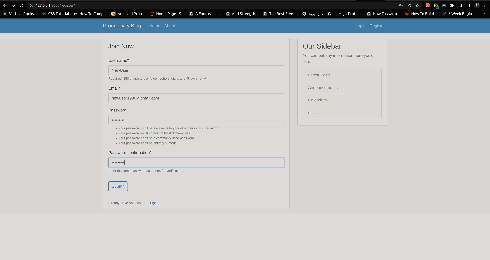
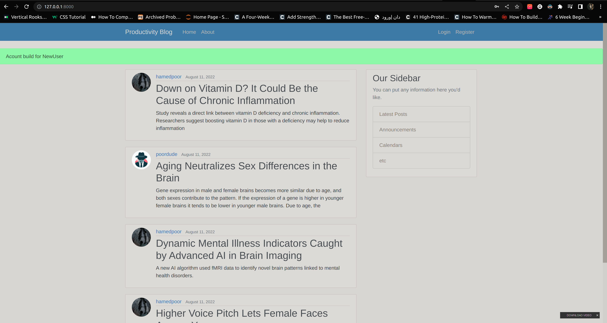
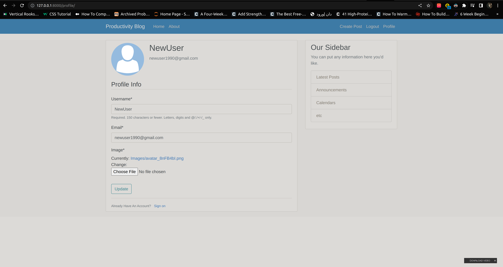
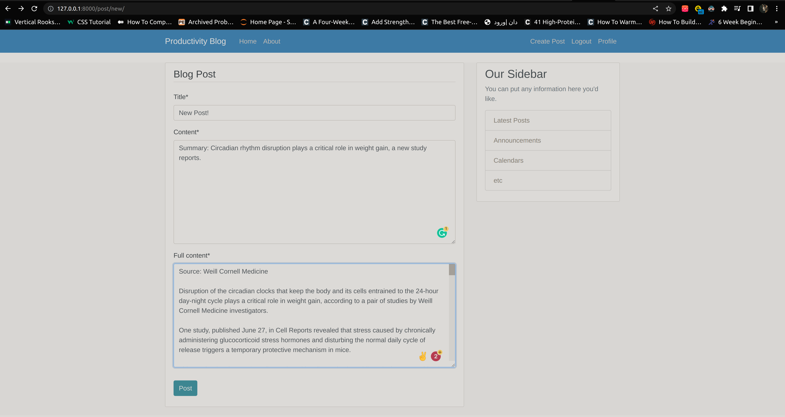
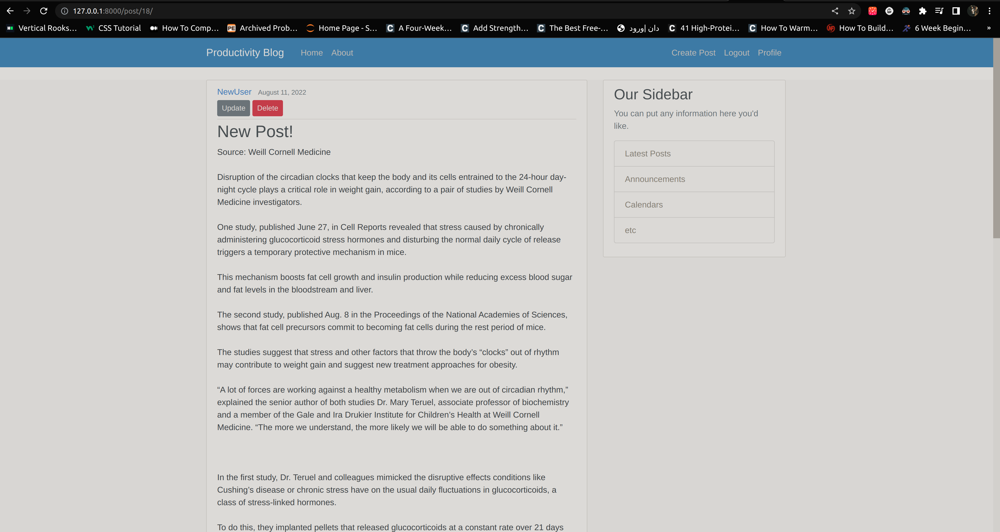
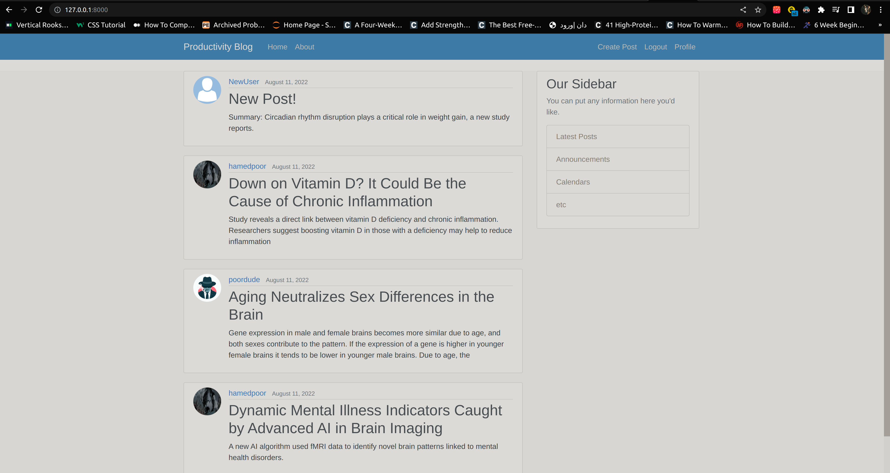

# Productivity Blog

<h3> Hi! this is a full-featured django blog about productivity and scientific stuff that you can register to it and post your articles.</h3>

<h3>• From register you can create a acount and you will redirect to home page with a flashy massage of success.</h3>
<h4> this register from-model made by built-in django user model and extensional email filed</h4> 

<h3>• When you create a acount you can login to your acount and you will have a profile with default profile picture!</h3>
<h4> with django singnals and a predfined profile-model, after creating instance for User-model, in database a profile atoumaticly create for that instance with default image profile</h4> 

<h3>• As you see after you log in at top of the page creating the new post abillity is available for you and you can after post a new article delete and update that post any time you want but remember you cant make change in another user posts!</h3>
<h4> with django mixins and login_required decorator we personalize some assebilties</h4> 
<h4> with class base views we have full CRUD funtionallity and uniqu url rout usting of primary key for every Post </h4> 

